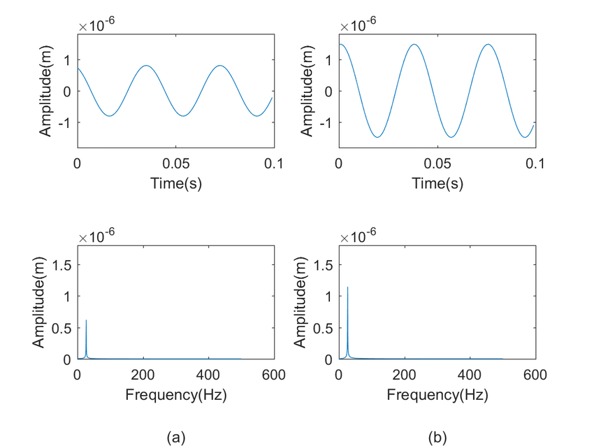

# 1. Constructing an FIR Filter in C++ and Gnuplot

## 1.1. Table of Contents
- [1. Constructing an FIR Filter in C++ and Gnuplot](#1-constructing-an-fir-filter-in-c-and-gnuplot)
  - [1.1. Table of Contents](#11-table-of-contents)
  - [1.2. Objectives](#12-objectives)
  - [1.3. Research Objectives](#13-research-objectives)
  - [1.4. About this repository](#14-about-this-repository)
  - [1.5. Filtering as a sub-domain of DSP](#15-filtering-as-a-sub-domain-of-dsp)
  - [1.6. Study](#16-study)
    - [1.6.1. Signals](#161-signals)
    - [1.6.2. Signal Processing](#162-signal-processing)
    - [1.6.3. Domains of a Signal](#163-domains-of-a-signal)
    - [1.6.4. Digital and Analog Signals](#164-digital-and-analog-signals)
      - [1.6.4.1. Digital Signals](#1641-digital-signals)
      - [1.6.4.2. Analog Signals](#1642-analog-signals)
      - [1.6.4.3. What's the difference?](#1643-whats-the-difference)
  - [1.7. Resources](#17-resources)

## 1.2. Objectives
- [ ] Input and analyse signals
- [ ] Implement an FIR (low band-pass) filter on the signal
- [ ] Plot both original and processed signals using gnuplot
- [ ] Proof of concept with real data
  - [ ] Use `.mp3` files as input to the program
  - [ ] Visualise the cleaning of the signal
- [ ] Implement for different data structures
- [ ] Analyse the complexities and study differences
  - [ ] See if the DS has any correlation to the type of signal inputted
- [ ] Write report and presentation on the affect of different DSs
- [ ] Outcome of the minor project is the best DS to implement in the use case of digital signals
- [ ] Segue to the research paper

## 1.3. Research Objectives
- [ ] Document study on brain waves and their characteristics
- [ ] Generate our own brain waves using machine learning/Find dataset on brain waves
- [ ] Data preprocessing and data cleaning
  - [ ] Filtering - Conclusion from the minor project
- [ ] Feature extraction
- [ ] Machine Learning - Classification of brain signals into moods/emotions

## 1.4. About this repository
This minor project in Digital Signal Processing (DSP) is to implement a Finite Impulse Response (FIR) filtering application of continuous data in C++ using the concept of a circular buffer.

The plotting of the filtered continuous data/signal is done in gnuplot in addition to the comparison of the signal before processing and after the FIR filter is applied. This plotting is done by sending data to the gnuplot application with a piping method.

## 1.5. Filtering as a sub-domain of DSP
Filtering is a class of signal processing wherein a device, known as the filter, removes some of the components or features from a signal. The defining feature of filters is the complete or partial suppression of some aspect of the signal inputted to the filter.

The Finite Impulse Response filter is a filter that has a finite impulse response duration. Meaning, the filter will settle to zero at a finite time. A very common application of FIR filter is for removing high frequency noise, that is as a low-pass filter.

## 1.6. Study
### 1.6.1. Signals
In signal processing, **a signal is a function that conveys information about a phenomenon**. Any quantity that can vary over space or time can be used as a signal to share messages between observers.

**An important property of a signal is its entropy or information content**. Information theory serves as the formal study of signals and their content. The information of a signal is often accompanied by noise, which primarily refers to unwanted modifications of signals, but is often extended to include unwanted signals conflicting with desired signals (crosstalk).

The reduction of noise is covered in part under the heading of signal integrity. The separation of desired signals from background noise is the field of signal recovery, one branch of which is estimation theory, a probabilistic approach to suppressing random disturbances.

### 1.6.2. Signal Processing
**Signal processing** is an electrical engineering subfield that **focuses on analysing, modifying, and synthesizing signals such as sound, images, and scientific measurements**. Signal processing techniques can be used to improve transmission, storage efficiency and subjective quality and to also emphasize or detect components of interest in a measured signal.

### 1.6.3. Domains of a Signal
There are two domains of a signal, a time domain and a frequency domain.

Refer to this [article](https://learnemc.com/time-frequency-domain) for a more comprehensive look on what the different domains are and how their conversions are made simple by fourier transforms.

The following visuals are the key to understanding the difference between the two domains of signals

Here are two simple sinusoidal analog signals in the time domain converted to their representation in the frequency domain.

Here is a cross section of the domains demonstrating how the two, time and frequency, are related and are just different ways of looking at a signal.

The same visual as the one above but less cluttered.

Taking away that cross-section, it's easy to now relate the two domains just by looking at the two representations of the same signal. That's demonstrated in the following visuals.

### 1.6.4. Digital and Analog Signals
#### 1.6.4.1. Digital Signals
Digital signal processing (DSP) is the use of digital processing, such as by computers or more specialized digital signal processors, to perform a wide variety of signal processing operations. **The digital signals processed in this manner are a sequence of numbers that represent samples of a continuous variable in a domain such as time, space, or frequency**. In digital electronics, a digital signal is represented as a pulse train, which is typically generated by the switching of a transistor.

**DSP is the processing of digitized discrete-time sampled signals**. Processing is done by general-purpose computers or by digital circuits such as ASICs, field-programmable gate arrays or specialized digital signal processors (DSP chips). Typical arithmetical operations include fixed-point and floating-point, real-valued and complex-valued, multiplication and addition. Other typical operations supported by the hardware are **circular buffers** and lookup tables.

Examples of algorithms are the fast Fourier transform (FFT), **finite impulse response (FIR) filter**, Infinite impulse response (IIR) filter, and adaptive filters such as the Wiener and Kalman filters.

#### 1.6.4.2. Analog Signals
Analog signal processing is a type of signal processing **conducted on continuous analog signals by some analog means (as opposed to the discrete digital signal processing where the signal processing is carried out by a digital process)**. Analog values are typically represented as a voltage, electric current, or electric charge around components in the electronic devices. An error or noise affecting such physical quantities will result in a corresponding error in the signals represented by such physical quantities.

Examples of analog signal processing include crossover filters in loudspeakers, bass, treble and volume controls on stereos, and tint controls on TVs. Common analog processing elements include capacitors, resistors and inductors (as the passive elements) and transistors or opamps (as the active elements).

#### 1.6.4.3. What's the difference?
- **Analog** indicates something that is mathematically represented as a set of continuous values. This differs from **digital** which uses a series of discrete quantities to represent signal.
- **Analog** signals are those signals which are **continuous in time domain**. It may be discrete or continuous in magnitude domain (value).
- **Digital** signals are those which are **discrete in both magnitude and time domain**.

Here are a couple of visuals to help better distinguish between the two kinds of signals.

1. At a glance, here's what an analog signal would look like compared to a digital signal. 
2. Here's how you would go about converting an analog signal (in continuous-time form) to a digital signal (after quantisation of a discrete-time signal.) 
3. Here's another example of how an analog signal is converted to a digital signal. This one explains how sampling and quantisation can be done in any order to achieve the same digital signal for a single analog signal. 

## 1.7. Resources
1. [Tutorial to learn about implementing FIR filters in C++.](https://www.wasyresearch.com/tutorial-c-c-implementation-of-circular-buffer-for-fir-filter-and-gnu-plotting-on-linux/)
2. [Amazing Quora article.](https://www.quora.com/Where-do-we-use-fir-filters)
3. [Differences between domains of a signal.](https://learnemc.com/time-frequency-domain)
4. [Research paper on *Framework for the Classification of Emotions in People With Visual Disabilities Through Brain Signals*.](https://www.frontiersin.org/articles/10.3389/fninf.2021.642766/full)
5. [Machine Learning, Neural Networks and Signal Processing - Medium article.](https://towardsdatascience.com/machine-learning-and-signal-processing-103281d27c4b)

[Back to the top!](#1-constructing-an-fir-filter-in-c-and-gnuplot)